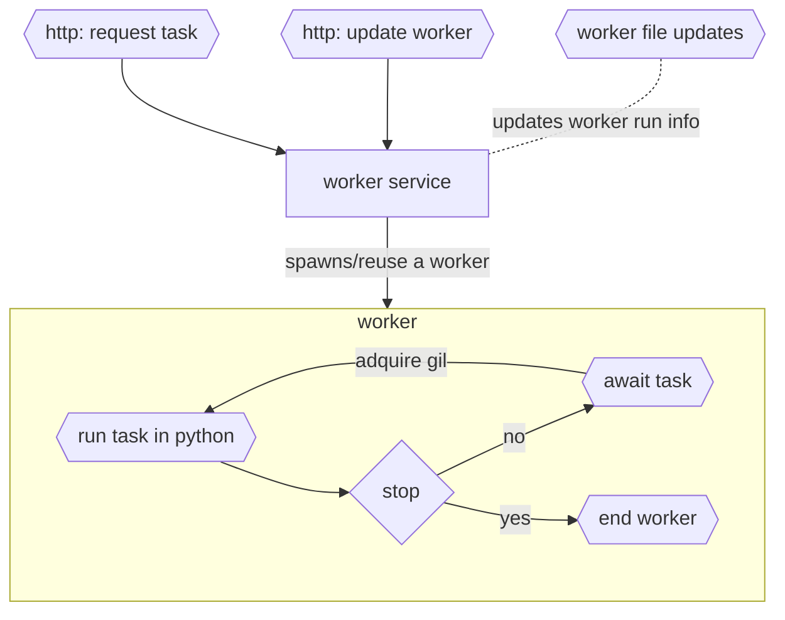

# Pyrform

Rust in memory programmable python task queue

```mermaid
graph TB;
  http_task{{http: request task}}-->service[worker service]

  http_worker{{http: update worker}}-->service[worker service]

  service--spawns/reuse a worker-->worker{{worker queue}}

  notify{{worker file updates}}-.-|updates worker run info| service

  subgraph worker
    direction LR
    perform-->stop{stop}
    stop-->|no| channel
    stop-->|yes| exit{{end worker}}
    channel{{await task}}--adquire gil-->perform{{run task in python}}
  end
```

## Endpoints

## Between task communication

## Downsides: the GIL