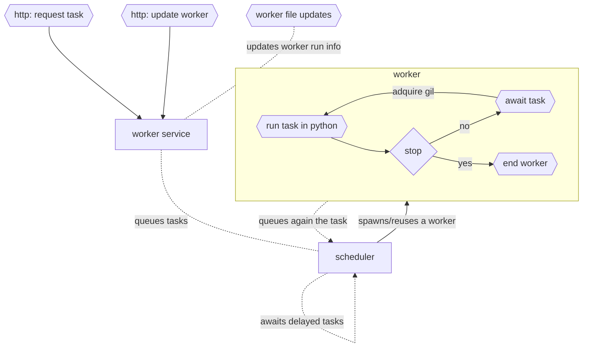

# Pyrform

Rust in memory programmable python task queue service.



## Usage

```
Usage: pyrform [OPTIONS] [PATH]

Arguments:
  [PATH]  workers' source files [default: ./workers]

Options:
  -b, --bind <BIND>   [default: 0.0.0.0:3000]
  -e, --edit-workers  expose the /worker endpoint
  -h, --help          Print help
  -V, --version       Print version
```

## Endpoints

- `/task`
  - `GET` retrives all the tasks and the current status of each one
  - `POST` sends another task to be processed
- `/task/:id`
  - `GET` retrieves the status of a task
- `/task/:id/cancel`
  - `POST` cancels a task
- `/worker/:name`
  - `GET` retrieves the worker source
  - `POST` writes a worker into the directory. must use *?replace=true* query to overwrite and already existing worker
  - `DEL` deletes the worker source

### How to queue a task?

To queue a task is really simple, you can achive it with a **POST JSON HTTP** request through the `/task` endpoint:

- `worker: string` is the name of the worker you are going to use.
- `function: string (default = worker)` is the name of the function inside the worker to call. Can be omitted.
- `title: option<string> (default = empty)` is the title of the task. Can be omitted.
- `dedicated: bool (default = false)` whether to spawn or not an empty worker for the task. can be omitted.
- `args: string[] (default = [])` are the arguments to perform the task with. Can be omitted resulting in an empty array.
- `delay: (int | float) > 0 (default = 0)` is the delay to wait before running the task. If the task is queued again, it can behave like a *cron* job unless it's also changed during task execution. Can be omitted.

The task result can be consulted at `GET /task` or `GET /task/:id`.

## How does a worker work?

A worker awaits a **task** and then executes the chosen function within the loaded *module* from the *python* source file. If the source file is changed, renamed, or removed, the server will detect and update the worker source or remove it. In case of being removed the worker will accept no more tasks.

Once the worker loads a task, it will require to adquire the GIL to execute the given task. If the worker source code has been updated/changed, it will have to be recompiled after adquiring the GIL.

Internally if a worker is cloned it would share the same *channels* and *run info*, that means:
- all the workers share the same **channels** and awaits the same tasks, so they will compete for one to execute.
- since they all use the same **run info**, every worker clone will be updated with the same python source.
  
This behaviour is still unused in any form but nowadays the second feature is already exploited and not through cloning: Since the `dedicated` flag in the tasks allows to compete for CPU in a worker with an empty *channel*, instead of using an already existing worker, the service creates a new worker with the requested **run info**/**source** and empty channels that will run only this one task.

## Fault tolerance

Tasks have two types of error status: `Fail` and `Error`, being the first one an error during the worker task processing but only during *execution time*, otherwise `Error` is applied. When `Fail` is returned, as with the `Done` status, *duration_total* and *duration_execution* fields are filled up.

Regardless of the error, both `Fail` and `Error` will exit the worker `GIL` scope, forcing the python context to recompile the *module* in order to prevent any bad module shared state.

Each worker is configured with a maximum number of `retries`, when this limit is reached the worker will end working. This behaviour is only a warning since future tasks can awake back another worker of the same type. If the problem is for example, worker source code related, this *retry, end, awake* behaviour will persist until the source is fixed.

## Downsides: the GIL

To process and run the python code, a worker needs to adquire the *GLOBAL INTERPRETER LOCK*, this causes that only one task can be executed at a time, so no parallelism is possible during source compilation and task execution. The only way to bypass the GIL is by spawning multiple processes to take advantage of all processors. This solution has not been implemented since that could be achived through load balancing over multiple `pyrform` processes.

In order to overcome this issue the best strategy is to divide the work in small tasks so the concurrency increases. During the execution of the task, we can mutate it, so the arguments or even the worker can be changed among other task properties. If the method *queue_again* is called the task will be marked as **queue_again** so it's send to the `scheduler service` back.

In the following simple example we return the first element of the task arguments and if there is still elements in the list, the task is *queued again*. Adding a delay in the task request or even inside the worker before queued again would give us a timespan to request the generated output before it is executed again, and the output is overwritten. 
```python
def worker(task):
  if not len(task.args): return

  first, task.args = task.args[0], task.args[1:]

  if len(task.args): task.queue_again()

  return first
```