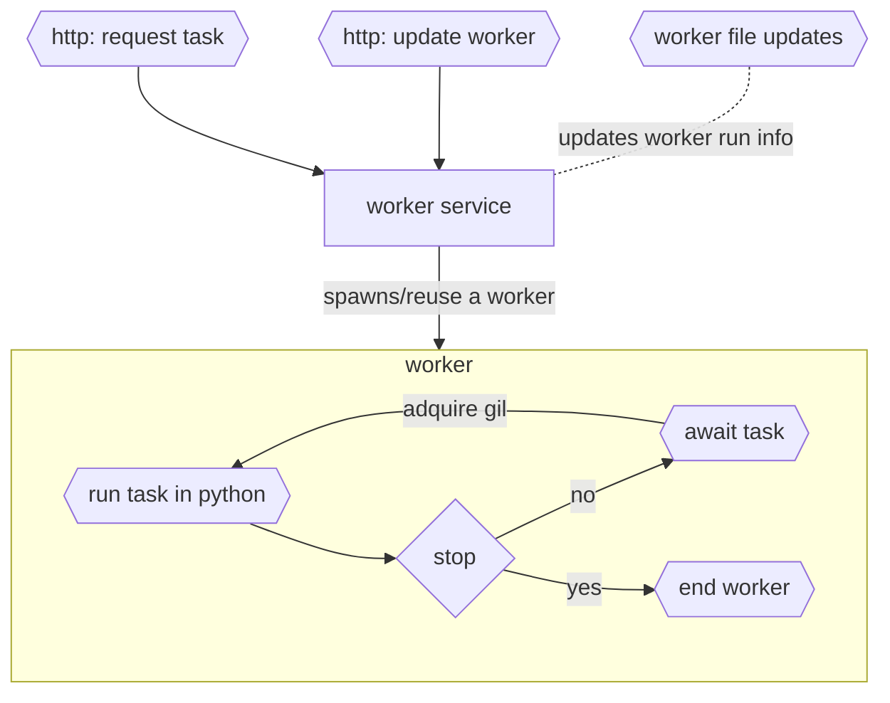

# Pyrform

Rust in memory programmable python task queue



## Usage

```
Usage: pyrform [OPTIONS] [PATH]

Arguments:
  [PATH]  workers' source files [default: ./workers]

Options:
  -b, --bind <BIND>   [default: 0.0.0.0:3000]
  -e, --edit-workers  expose the /worker endpoint
  -h, --help          Print help
  -V, --version       Print version
```

## Endpoints

- `/task`
  - `GET` retrives all the tasks and the current status of each one
  - `POST` sends another task to be processed
- `/task/:id`
  - `GET` retrieves the status of a task
- `/task/:id/cancel`
  - `POST` cancels a task
- `/worker/:name`
  - `GET` retrieves the worker source
  - `POST` writes a worker into the directory. must use *?replace=true* query to write and already existing worker
  - `DEL` deletes the worker source

## How a worker works

A worker runs awaits a **task** and then executes the chosen function within the loaded *module* from the *python* source file.

If the source file is changed, renamed, or removed, the server will detect and update the worker source or remove it.
In case of being removed the worker will accept no more tasks.

Once the worker loads a task, it will require to adquire the GIL to execute the given task. If the worker source code has been updated/changed, it will have to be recompiled.

## Downsides: the GIL

In order to run python code a worker needs to adquire the *GLOBAL INTERPRETER LOCK*, this causes that only one task can be executed at a time, so no parallelism is possible.
The only way to bypass the GIL is spawning multiple processes in order to take advantage of all processors. This solution has not been implemented since that could be achived through load balancing over multiple `pyrform` processes.